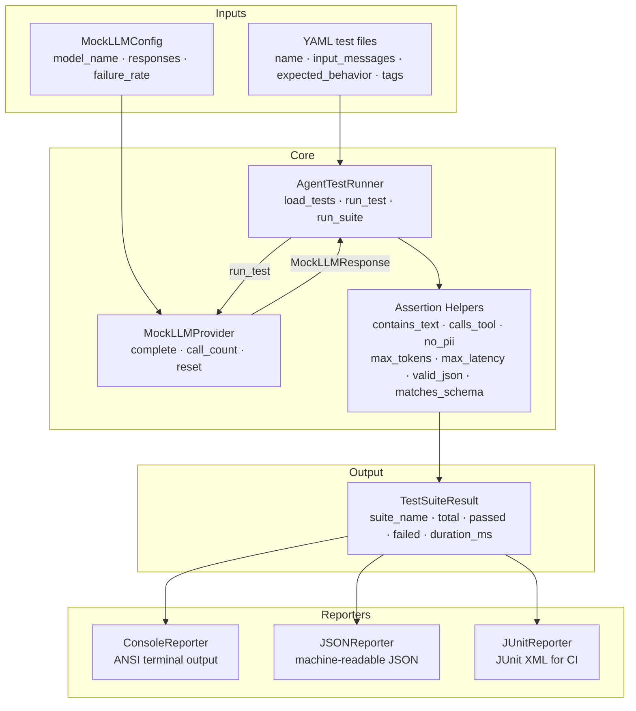

# aumai-agentci

**CI/CD testing framework for AI agents.**

Part of the [AumAI](https://github.com/aumai) open-source agentic infrastructure suite.

[](https://github.com/aumai/aumai-agentci/actions)
[](https://pypi.org/project/aumai-agentci/)
[](LICENSE)

---

## What is this?

When a software team adds a new feature, they run unit tests and integration
tests before shipping. If the tests fail, the build fails and nothing goes out.
AI agents deserve exactly the same treatment — but standard testing frameworks
were built for code that is deterministic, not for LLMs that produce different
output every time.

`aumai-agentci` solves this by giving you:

1. **A declarative YAML format** for defining agent test cases — what messages
   to send, and what behaviors you expect in return.
2. **A mock LLM provider** that serves pre-scripted responses, making your
   agent tests fully deterministic and fast.
3. **A set of assertion helpers** that check agent outputs for correctness
   without requiring exact string matching — covering text content, tool calls,
   PII leaks, token budgets, latency, and JSON schema conformance.
4. **A test runner** that executes suites serially or in parallel and produces
   text, JSON, or JUnit XML reports.
5. **A CLI** that integrates with any CI pipeline (GitHub Actions, GitLab CI,
   Jenkins, etc.) and exits with code 1 when any test fails.

The result: your agent's behavior is checked on every commit, the same way any
other code is.

---

## Why does this matter?

### The problem from first principles

AI agents are software that makes decisions. Like all software, they can break:

- A model update changes how the agent responds to a specific prompt.
- A prompt template refactor accidentally removes a crucial instruction.
- A new tool integration causes the agent to leak PII from its context window.
- A cost optimization reduces the token budget, breaking structured JSON output.

Without automated tests, these regressions are discovered by users in
production. With `aumai-agentci`, they are caught in CI before a single line
of changed code reaches a running agent.

### Why not just use pytest directly?

You can — and `aumai-agentci` is designed to work alongside pytest. The
additional value this library provides:

- **YAML-driven test cases** that non-engineers (product managers, security
  reviewers) can read and write.
- **Mock LLM providers** that eliminate API costs, rate limits, and
  non-determinism from CI.
- **Agent-specific assertions** (tool call detection, PII scanning, schema
  validation) that are tedious to implement from scratch.
- **JUnit XML output** that works out of the box with every major CI platform.

---

## Architecture



---

## Features

- **YAML-driven test cases** — define agent tests in plain text; no Python
  required for basic cases.
- **Mock LLM provider** — round-robin, deterministic responses with optional
  simulated failure injection.
- **Seven built-in assertions** — `contains_text`, `calls_tools`, `no_pii`,
  `max_tokens`, `max_latency_ms`, `valid_json`, `matches_schema`.
- **Parallel test execution** — optional `--parallel` flag runs test cases in
  threads, each with its own provider instance.
- **Three output formats** — human text, machine JSON, and JUnit XML.
- **Fixture factories** — `create_mock_openai` and `create_mock_anthropic`
  give you realistic pre-configured providers in one line.
- **`load_test_suite` helper** — load test cases from a file or directory
  for use in pytest or custom runners.
- **`validate` CLI command** — check YAML syntax and detect duplicate names
  without running tests.
- **`init` CLI command** — scaffold a complete example test directory with
  sample tests and mock config in seconds.

---

## Quick Start

### Install

```bash
pip install aumai-agentci
```

### Initialize a test directory

```bash
aumai-agentci init agent-tests
```

This creates `agent-tests/sample_tests.yaml` and `agent-tests/mock_config.yaml`
with working examples.

### Run the tests

```bash
aumai-agentci test agent-tests/ --mock-config agent-tests/mock_config.yaml
```

Expected output:

```
Test Suite: agent-tests
============================================================
  [PASS] basic_response (2.1 ms)
  [PASS] no_pii_in_response (0.8 ms)
  [PASS] json_output (1.2 ms)
  [PASS] tool_call_check (0.9 ms)
  [PASS] token_budget (0.7 ms)
------------------------------------------------------------
Results: 5 passed, 0 failed, 5 total  (5.7 ms)
```

### Write your own test case

Create `my-tests/hello_test.yaml`:

```yaml
- name: greets_user
  description: Agent should greet the user by name.
  input_messages:
    - role: user
      content: "Hello, my name is Alice."
  expected_behavior:
    contains_text: "Alice"
    no_pii: false      # We expect "Alice" in the output; disable PII check
  tags:
    - smoke

- name: json_response
  description: Agent returns a valid JSON status object.
  input_messages:
    - role: user
      content: "Return your status as JSON."
  expected_behavior:
    valid_json: true
    matches_schema:
      type: object
      required:
        - status
      properties:
        status:
          type: string
  tags:
    - structured-output
```

Create `my-tests/mock.yaml`:

```yaml
model_name: mock-agent
responses:
  - content: "Hello Alice! How can I help you today?"
    model: mock-agent
    tokens_used: 12
    latency_ms: 50.0
    finish_reason: stop
  - content: '{"status": "ready", "version": "1.0"}'
    model: mock-agent
    tokens_used: 20
    latency_ms: 40.0
    finish_reason: stop
```

```bash
aumai-agentci test my-tests/ --mock-config my-tests/mock.yaml
```

---

## CLI Reference

### `aumai-agentci test`

Run all test cases in a directory.

```
Usage: aumai-agentci test [OPTIONS] [TEST_DIR]

Arguments:
  TEST_DIR  Directory containing YAML test case files.  [default: tests/]

Options:
  --mock-config FILE        Path to a YAML mock LLM configuration file.
  --timeout FLOAT           Per-suite timeout in seconds.  [default: 30.0]
  --output [text|json|junit]  Output format.  [default: text]
  --parallel                Run test cases in parallel threads.
  --out-file FILE           Write report output to FILE instead of stdout.
  --version                 Show the version and exit.
  --help                    Show this message and exit.
```

**Examples:**

```bash
# Basic run with console output
aumai-agentci test tests/

# JSON output for dashboards
aumai-agentci test tests/ --output json

# JUnit XML for GitHub Actions
aumai-agentci test tests/ --output junit --out-file results.xml

# Parallel execution with custom mock
aumai-agentci test tests/ --mock-config mock.yaml --parallel

# Integration into CI: non-zero exit code on failure
aumai-agentci test tests/ || exit 1
```

**Exit codes:**
- `0` — all tests passed.
- `1` — one or more tests failed, or the runner encountered a fatal error.

---

### `aumai-agentci init`

Scaffold an example test directory.

```
Usage: aumai-agentci init [OPTIONS] [DIRECTORY]

Arguments:
  DIRECTORY  Directory to create.  [default: agent-tests]

Options:
  --force   Overwrite existing files.
  --help    Show this message and exit.
```

**Created files:**

| File | Contents |
|---|---|
| `DIRECTORY/sample_tests.yaml` | Five example test cases covering all assertion types |
| `DIRECTORY/mock_config.yaml` | A `MockLLMConfig` with four pre-scripted responses |

**Example:**
```bash
aumai-agentci init my-agent-tests
aumai-agentci test my-agent-tests/ --mock-config my-agent-tests/mock_config.yaml
```

---

### `aumai-agentci validate`

Validate test YAML files without running them.

```
Usage: aumai-agentci validate [OPTIONS] TEST_DIR

Arguments:
  TEST_DIR  Directory containing YAML test case files.  [required]

Options:
  --strict  Exit with code 1 if any validation warnings are found.
  --help    Show this message and exit.
```

Checks performed:
- YAML syntax validity.
- Required fields (`name` is required).
- No duplicate test case names within the directory.
- `expected_behavior` keys are all recognized.
- Tests with no `expected_behavior` (will always pass) emit a warning.
- Tests with no `input_messages` emit a warning.

**Examples:**
```bash
aumai-agentci validate tests/
aumai-agentci validate tests/ --strict  # fail on warnings
```

---

## Test Case YAML Format

Each YAML file may contain a single mapping, a list of mappings, or a top-level
`tests:` key wrapping a list:

```yaml
# Format 1: top-level tests key (recommended for grouping)
tests:
  - name: my_test
    ...

# Format 2: top-level list
- name: my_test
  ...

# Format 3: single mapping
name: my_test
...
```

### Test case fields

| Field | Type | Required | Description |
|---|---|---|---|
| `name` | `str` | Yes | Unique identifier for the test case. |
| `description` | `str` | No | Human-readable description. |
| `input_messages` | `list[dict]` | No | Messages to send to the agent. Same shape as OpenAI/Anthropic message arrays. |
| `expected_behavior` | `dict` | No | Assertion keys and values. |
| `tags` | `list[str]` | No | Labels for filtering (not yet applied by the runner, but supported for tooling). |

### Assertion keys in `expected_behavior`

| Key | Value type | Passes when |
|---|---|---|
| `contains_text` | `str` | Output contains the string (case-insensitive) |
| `calls_tools` | `str` or `list[str]` | Output contains evidence of the named tool call(s) |
| `max_tokens` | `int` | `tokens_used <= max_tokens` |
| `max_latency_ms` | `float` | `latency_ms <= max_latency_ms` |
| `no_pii` | `bool` (true) | Output contains no email, phone, SSN, or credit card |
| `valid_json` | `bool` (true) | Output parses as valid JSON |
| `matches_schema` | JSON Schema `dict` | Output (parsed as JSON) validates against the schema |

---

## Python API Examples

### Running a single test case

```python
from aumai_agentci import (
    AgentTestRunner, MockLLMProvider, MockLLMConfig, MockLLMResponse,
    AgentTestCase,
)

mock_config = MockLLMConfig(
    model_name="mock-gpt",
    responses=[
        MockLLMResponse(
            content="Hello! I can help with that.",
            model="mock-gpt",
            tokens_used=12,
            latency_ms=50.0,
            finish_reason="stop",
        )
    ],
)
provider = MockLLMProvider(mock_config)

test_case = AgentTestCase(
    name="greeting_test",
    input_messages=[{"role": "user", "content": "Hello"}],
    expected_behavior={"contains_text": "hello"},
)

runner = AgentTestRunner()
result = runner.run_test(test_case, provider)

print(result.passed)             # True
print(result.assertions_passed)  # ["contains_text: 'hello'"]
```

### Using fixture factories

```python
from aumai_agentci import create_mock_openai, create_mock_anthropic

# OpenAI-style mock with 3 default responses
openai_provider = create_mock_openai()
response = openai_provider.complete([{"role": "user", "content": "Hello"}])
print(response.model)  # "gpt-4o"

# Anthropic-style mock with simulated failures
anthropic_provider = create_mock_anthropic(failure_rate=0.10)
```

### Loading and running a full suite

```python
from aumai_agentci import AgentTestRunner, AgentTestConfig, MockLLMConfig, MockLLMResponse

config = AgentTestConfig(
    test_dir="tests/",
    mock_config=MockLLMConfig(
        model_name="mock",
        responses=[MockLLMResponse(
            content="OK", model="mock", tokens_used=5,
            latency_ms=10.0, finish_reason="stop",
        )],
    ),
    timeout_seconds=30.0,
    parallel=False,
)

runner = AgentTestRunner()
suite = runner.run_suite("tests/", config)

print(f"{suite.passed}/{suite.total} tests passed in {suite.duration_ms:.1f} ms")
```

### Using assertion helpers directly

```python
from aumai_agentci import (
    assert_contains_text, assert_calls_tool, assert_no_pii,
    assert_valid_json, assert_matches_schema,
)

output = '{"status": "ok", "user": "alice@example.com"}'

print(assert_contains_text(output, "status"))         # True
print(assert_no_pii(output))                          # False (email address)
print(assert_valid_json(output))                      # True
print(assert_matches_schema(output, {
    "type": "object",
    "required": ["status"],
    "properties": {"status": {"type": "string"}},
}))                                                   # True
```

---

## Integration with Other AumAI Projects

| Project | Integration pattern |
|---|---|
| **aumai-trustforge** | Call `TrustScorer` inside a post-suite hook to assert trust score thresholds |
| **aumai-capsule** | Record mock provider calls as capsule steps for replay in regression testing |
| **aumai-specs** | Load `AgentTestCase` objects from spec-generated YAML files |

---

## GitHub Actions Example

```yaml
# .github/workflows/agent-tests.yml
name: Agent Tests

on: [push, pull_request]

jobs:
  test:
    runs-on: ubuntu-latest
    steps:
      - uses: actions/checkout@v4

      - name: Set up Python
        uses: actions/setup-python@v5
        with:
          python-version: "3.11"

      - name: Install dependencies
        run: pip install aumai-agentci

      - name: Run agent tests
        run: |
          aumai-agentci test tests/ \
            --mock-config tests/mock_config.yaml \
            --output junit \
            --out-file test-results.xml

      - name: Publish test results
        uses: mikepenz/action-junit-report@v4
        if: always()
        with:
          report_paths: test-results.xml
```

---

## Contributing

Contributions are welcome. Please read `CONTRIBUTING.md` before opening a PR.

Key guidelines:
- Python 3.11+, `mypy --strict` must pass.
- New assertions require tests for the true-positive, true-negative, and
  edge-case paths.
- YAML test case format changes must be backward-compatible.
- Adding a new reporter requires implementing the `BaseReporter` abstract class.

```bash
git clone https://github.com/aumai/aumai-agentci
cd aumai-agentci
pip install -e ".[dev]"
make test
make lint
```

---

## License

Apache License 2.0. See `LICENSE` for the full text.
